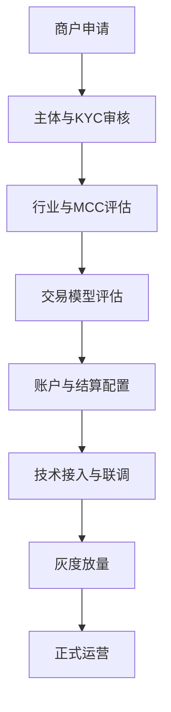

# 02 进件与接入

> 版本：v0.2  
> 更新时间：2026-04-21  
> 作者：payment-docs  
> 审核：TBD

## 3分钟速读（入门优先）

- 进件不是一次性审批动作，而是“准入 + 持续复审”的长期机制。
- 支付接入不是只对 API，要同时落地路由、风控、结算和监控。
- 最稳妥的入门认知是把“商户模型、风险模型、技术模型”一起设计。

## 一、本章要解决的问题

- 问题 1：商户进件（Onboarding）到底审什么？
- 问题 2：支付接入为什么不是“对一个 API”这么简单？
- 问题 3：如何把进件、路由、风控做成可扩展体系？

## 二、先修知识

- 建议先阅读：[01-角色与网络.md](01-角色与网络.md)
- 推荐术语预习：KYC、MCC、PSP、PF、Gateway

## 三、一图总览

图说明：

- 输入：商户入驻申请与基础资料。
- 处理：准入审核、风控评估、技术接入、灰度验证。
- 输出：可稳定运营的收单能力。

## 四、核心概念定义

### 4.1 商户进件（Merchant Onboarding）

- 定义：从商户身份识别、风险评估到开通支付能力的完整过程。
- 边界：不是一次性流程，需伴随持续复审与风险重评。
- 常见误解：把进件仅理解为提交营业执照。

### 4.2 交易模型评估

- 定义：识别商户交易特征，如客单价、发货周期、退款率、争议概率。
- 边界：与行业类别相关，但不等同于行业类别。
- 常见误解：只看行业，不看履约路径与交易行为。

## 五、主流程拆解

### 5.1 阶段 1：准入审核

- 参与方：商户运营、合规、风控。
- 关键输入：主体信息、受益人信息、业务描述、历史交易表现。
- 核心动作：KYC、AML、黑名单比对、行业风险分层。
- 关键输出：准入结论与风控等级。

### 5.2 阶段 2：账户与结算配置

- 参与方：收单运营、财务结算、商户成功团队。
- 关键输入：目标市场、币种、结算周期、费率与准备金策略。
- 核心动作：创建商户账户、绑定收款账户、配置结算模板。
- 关键输出：可执行的计费与结算参数。

### 5.3 阶段 3：技术接入与灰度

- 参与方：商户技术、平台技术、风控技术。
- 关键输入：API 密钥、回调地址、路由策略、风控策略模板。
- 核心动作：联调、压测、灰度放量、监控告警联动。
- 关键输出：生产可用且可观测的支付链路。

## 六、常见异常与误区

### 6.1 进件通过后大面积拒付

- 现象：上线后短期内争议率快速上升。
- 根因：准入模型过度依赖静态资料，低估履约与客服能力风险。
- 排查路径：回看进件评分卡 -> 对比履约与退款数据 -> 调整准入阈值。

### 6.2 技术接入完成但支付成功率低

- 现象：接口调用成功，授权通过率异常偏低。
- 根因：路由策略与商户业务场景不匹配，缺少本地化通道策略。
- 排查路径：分国家/币种/卡组织看通过率 -> 优化路由与降级策略。

## 七、实战案例

案例背景：

- 地区：拉美
- 支付方式：外卡 + 本地支付
- 商户类型：平台型商户（多子商户）
- 关键约束：子商户质量参差、退款周期长

案例过程：

1. 采用主商户+子商户分层准入，按风险等级分配通道。
2. 高风险子商户使用更严格风控与更长结算周期。
3. 上线后通过灰度分流调整路由，将整体拒付率控制在目标阈值内。

案例结论：

- 成功点：把准入策略和结算策略联动。
- 失败点：初期低估了客服响应时效对争议率的影响。
- 可复用策略：准入评估必须覆盖“履约能力+资金风险+技术能力”。

## 新手最容易错的 3 件事

1. 只做证照审核，不做交易模型评估，导致上线后风险爆发。
2. 技术联调通过就直接放量，缺少灰度和回滚预案。
3. 路由、风控、结算各自配置，缺少统一策略联动。

## 八、Checklist

- [ ] 是否有标准化进件评分卡与准入阈值
- [ ] 是否按国家/行业/交易模型分层建档
- [ ] 是否配置路由、风控、结算三套联动策略
- [ ] 是否完成灰度与回滚预案验证

## 九、本章总结

- 进件是长期风险管理的起点，不是一次性审批动作。
- 接入能力要和商户交易模型匹配，而非统一模板套用。
- 商户规模化前，先把准入、路由、风控联成一套系统。

## 十、下一章预告

下一章将回答：一笔交易从请求到到账，会经历哪些状态与关键控制点。

## 附：变更记录

- 2026-04-21 v0.2：统一入门结构，新增 3 分钟速读与新手易错点。
- 2026-04-20 v0.1：基于系列内容整理首版。
