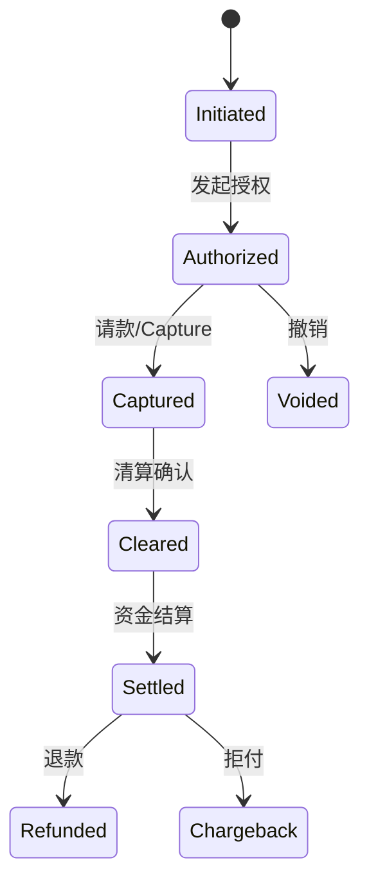

# 03 交易生命周期

> 版本：v0.2  
> 更新时间：2026-04-21  
> 作者：payment-docs  
> 审核：TBD

## 3分钟速读（入门优先）

- 授权、清算、结算是三种不同确定性，不可混成一个“成功”状态。
- 生命周期必须同时覆盖正向流程（支付）和逆向流程（退款、拒付）。
- 新人先记住：交易系统状态不等于财务到账状态。

## 一、本章要解决的问题

- 问题 1：为什么交易生命周期必须拆成 Authorization / Clearing / Settlement？
- 问题 2：业务系统和财务系统应该共享哪套状态机？
- 问题 3：如何避免 `Void`、`Refund`、`Chargeback` 混用？

## 二、先修知识

- 建议先阅读：[01-角色与网络.md](01-角色与网络.md)
- 推荐术语预习：Authorization、Capture、Clearing、Settlement、Void、Refund

## 三、一图总览

图说明：

- 输入：一笔商户侧支付请求。
- 处理：先确认可交易，再确认可记账，最后确认资金归属变化。
- 输出：交易状态、账务状态、资金状态三条链路闭环。

## 四、核心概念定义

### 4.1 三种确定性

- 交易确定性：是否允许本次交易发生（Authorization）。
- 账务确定性：交易是否被正式确认并入账（Clearing）。
- 资金确定性：资金是否完成交收并可对外释放（Settlement）。

### 4.2 状态建模边界

- 定义：状态机必须能支持正向流程与逆向流程并存。
- 边界：交易系统状态不直接等价于财务到账状态。
- 常见误解：把 `payment_success` 当作最终状态。

## 五、主流程拆解

### 5.1 阶段 1：Authorization

- 参与方：Merchant、Acquirer、Network、Issuer。
- 关键输入：卡信息、金额、币种、风险信号。
- 核心动作：发卡行执行额度/风险/账户状态校验。
- 关键输出：授权通过或拒绝。

### 5.2 阶段 2：Capture 与 Clearing

- 参与方：Merchant、Acquirer、Network。
- 关键输入：授权结果、履约状态、Capture 触发条件。
- 核心动作：将可请款交易纳入清算，形成机构间应收应付。
- 关键输出：清算成功记录与账务凭证。

### 5.3 阶段 3：Settlement

- 参与方：Network、Acquirer、PSP、Merchant。
- 关键输入：清算净额、费用项、准备金规则、结算周期。
- 核心动作：完成资金交收、扣费、准备金冻结/释放、商户出款。
- 关键输出：可对账的结算批次与到账记录。

## 六、常见异常与误区

### 6.1 Authorization 成功但后续 Capture 失败

- 现象：用户看到成功，系统后续无法请款。
- 根因：超出 Capture 时间窗、金额变更不合规或接口遗漏。
- 排查路径：查授权有效期 -> 查 Capture 参数 -> 查网关回执。

### 6.2 交易状态和财务状态冲突

- 现象：业务系统显示成功，财务系统显示未结算。
- 根因：状态机未拆分交易、清算、结算三个层级。
- 排查路径：建立三层状态映射表 -> 逐层对账 -> 修正状态同步逻辑。

## 七、实战案例

案例背景：

- 地区：美国
- 支付方式：卡支付（含 3DS）
- 商户类型：订阅类 SaaS
- 关键约束：周期扣款、失败重试、退款频繁

案例过程：

1. 首次扣款走完整授权与清算流程。
2. 周期扣款按商户策略重试，失败交易进入失败重试队列。
3. 退款交易单独建反向状态流，不覆盖原交易状态。

案例结论：

- 成功点：正逆向交易分离，状态清晰。
- 失败点：初期将退款覆盖原交易，导致对账混乱。
- 可复用策略：把状态机作为支付平台的核心产品资产。

## 新手最容易错的 3 件事

1. 只维护单一 `payment_success` 状态，导致交易和资金口径错位。
2. 把 `Void`、`Refund`、`Chargeback` 当成同一类逆向动作。
3. 没有为失败重试和人工兜底建立事件流，异常长期悬挂。

## 八、Checklist

- [ ] 是否定义了交易/账务/资金三层状态
- [ ] 是否区分 Capture、Void、Refund 的触发条件
- [ ] 是否有失败重试和人工兜底流程
- [ ] 是否可按交易号追溯全生命周期事件

## 九、本章总结

- 生命周期拆分不是理论要求，而是对账和风控的工程前提。
- 正向交易与逆向交易必须并行建模。
- 支付平台成熟度很大程度取决于状态机质量。

## 十、下一章预告

下一章将回答：清算具体“清”什么，以及为什么很多问题出现在授权之后到账之前。

补充资料：

- 3DS 与 SCA 专题：[15-3DS与SCA专题.md](15-3DS与SCA专题.md)

## 附：变更记录

- 2026-04-21 v0.2：统一入门结构，新增 3 分钟速读与新手易错点。
- 2026-04-20 v0.1：基于系列内容整理首版。
