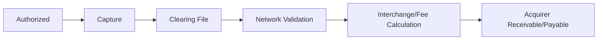

# 04 清算

> 版本：v0.2  
> 更新时间：2026-04-21  
> 作者：payment-docs  
> 审核：TBD

## 3分钟速读（入门优先）

- 清算核心是确认账务义务，不是简单传文件。
- 授权通过后仍可能因 Capture 或规则问题在清算失败。
- 清算质量直接影响结算准确性和后续争议处理效率。

## 一、本章要解决的问题

- 问题 1：清算（Clearing）到底在“清”什么？
- 问题 2：为什么授权通过后，交易仍可能在清算阶段失败？
- 问题 3：清算数据如何支撑后续结算与争议处理？

## 二、先修知识

- 建议先阅读：[03-交易生命周期.md](03-交易生命周期.md)
- 推荐术语预习：Capture、Clearing File、Interchange、Reconciliation

## 三、一图总览

图说明：

- 输入：已授权且可请款的交易。
- 处理：交易校验、账务确认、费用计算、应收应付生成。
- 输出：可用于结算和对账的清算结果。

## 四、核心概念定义

### 4.1 清交易与清账务

- 清交易：确认“这笔交易被正式承认”。
- 清账务：确认“谁应该收多少钱、付多少钱”。
- 常见误解：把清算理解成“只做文件传输”。

### 4.2 清算不是结算

- 定义：清算形成账务义务，结算完成资金交收。
- 边界：清算成功并不代表商户已到账。
- 常见误解：清算完成就等价于资金到位。

## 五、主流程拆解

### 5.1 阶段 1：Capture 与清算入池

- 参与方：Merchant、Gateway、Acquirer。
- 关键输入：授权号、金额、币种、交易时间、商户信息。
- 核心动作：校验 Capture 合法性并入清算批次。
- 关键输出：待清算交易明细。

### 5.2 阶段 2：网络清算与费用计算

- 参与方：Acquirer、Network、Issuer。
- 关键输入：清算报文、费率规则、网络规则版本。
- 核心动作：网络侧校验并生成费用与净额。
- 关键输出：机构间应收应付与费用明细。

### 5.3 阶段 3：清算对账

- 参与方：支付平台财务、运营、技术。
- 关键输入：平台交易台账、网络清算结果、渠道回执。
- 核心动作：逐笔/汇总对账、差异识别、差异工单流转。
- 关键输出：清算对账报告与差异处置结果。

## 六、常见异常与误区

### 6.1 授权通过但未及时清算

- 现象：交易长时间停留在 `Authorized`。
- 根因：商户未 Capture 或系统漏发 Capture。
- 排查路径：按授权时长分桶 -> 查 Capture 触发链路 -> 回补处理。

### 6.2 清算金额与授权金额不一致

- 现象：清算金额大于或小于授权金额。
- 根因：分次请款、货币换算、履约拆单、费用或税项处理差异。
- 排查路径：查原授权 -> 查 Capture 记录 -> 查币种与汇率来源。

## 七、实战案例

案例背景：

- 地区：英国
- 支付方式：外卡
- 商户类型：酒店预订
- 关键约束：预授权+离店补扣，金额变化频繁

案例过程：

1. 预授权锁定金额，离店后按实际消费发起最终 Capture。
2. 平台按“预授权交易”与“最终清算交易”建立关联键。
3. 每日运行清算差异任务，自动定位金额差异并归档原因。

案例结论：

- 成功点：预授权与最终请款关系可追踪。
- 失败点：早期未区分业务金额变化与系统异常变化。
- 可复用策略：清算异常必须分类治理，不要用单一规则兜底。

## 新手最容易错的 3 件事

1. 把清算和结算混为一体，误判到账时点。
2. 忽略 `Authorized 未 Capture` 监控，导致漏清算堆积。
3. 差异出现后只查金额，不查币种与汇率来源，定位效率低。

## 八、Checklist

- [ ] 是否监控 `Authorized 未 Capture` 的时长与比例
- [ ] 是否建立清算差异分类（金额/币种/重复/漏单）
- [ ] 是否支持逐笔追溯清算链路
- [ ] 是否将清算结果同步给结算与争议系统

## 九、本章总结

- 清算是账务确定性核心，不是“技术中转站”。
- 清算质量决定后续结算稳定性和争议可处理性。
- 清算差异治理要工程化与流程化并行推进。

## 十、下一章预告

下一章将回答：结算如何完成资金交收，以及为什么“到账时间”经常与交易时间错位。

## 附：变更记录

- 2026-04-21 v0.2：统一入门结构，新增 3 分钟速读与新手易错点。
- 2026-04-20 v0.1：基于系列内容整理首版。
