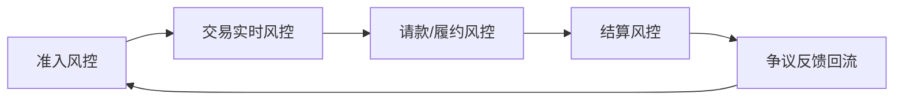

# 06 风控

> 版本：v0.2  
> 更新时间：2026-04-21  
> 作者：payment-docs  
> 审核：TBD

## 3分钟速读（入门优先）

- 收单风控不是单点拦截，而是覆盖准入、交易、结算、争议的全链路系统。
- 风控目标是平衡“损失控制”和“通过率增长”，不能只看一侧。
- 没有反馈闭环（评估、调参、回滚）的风控策略无法长期稳定。

## 一、本章要解决的问题

- 问题 1：收单风控到底在防哪些风险？
- 问题 2：风控为什么必须覆盖“准入-交易-结算-争议”全链路？
- 问题 3：如何把风控从规则堆叠升级为可持续系统？

## 二、先修知识

- 建议先阅读：[02-进件与接入.md](02-进件与接入.md)
- 建议先阅读：[05-结算.md](05-结算.md)

## 三、一图总览

图说明：

- 输入：商户、交易、行为、账务、争议多维数据。
- 处理：分阶段决策与风险动作执行。
- 输出：风险损失受控、通过率与体验平衡、策略持续迭代。

## 四、核心概念定义

### 4.1 风险类型

- 欺诈风险：盗刷、撞库、异常设备与异常行为。
- 信用风险：退款/拒付集中爆发导致资金回收困难。
- 合规风险：KYC/AML/PCI/数据隐私不满足监管要求。
- 经营风险：策略过严导致通过率和收入下降。

### 4.2 风控闭环

- 定义：策略上线后必须有反馈、评估、调参、再上线。
- 边界：只有拦截没有反馈，不算闭环。
- 常见误解：风控系统只靠模型或只靠规则即可稳定。

## 五、主流程拆解

### 5.1 阶段 1：准入风控

- 参与方：商户审核、合规、风控。
- 核心动作：主体识别、行业风险分层、交易模型预估。
- 关键输出：风险等级与基础额度/周期策略。

### 5.2 阶段 2：交易实时风控

- 参与方：风控引擎、交易系统、反欺诈系统。
- 核心动作：设备、IP、行为、历史交易与黑白名单决策。
- 关键输出：通过、拒绝、挑战、人工复核等动作。

### 5.3 阶段 3：结算与争议联动风控

- 参与方：结算系统、争议系统、商户运营。
- 核心动作：根据拒付率与退款率动态调整准备金与结算周期。
- 关键输出：风险敞口可控的资金策略。

## 六、常见异常与误区

### 6.1 风控通过率高但损失也高

- 现象：短期成功率提升，后续拒付与欺诈损失上升。
- 根因：策略偏向放量，缺少后验损失校准。
- 排查路径：按渠道/国家/商户分层复盘损失 -> 调整阈值与动作。

### 6.2 风控过严导致业务下滑

- 现象：拒绝率过高，商户投诉增长。
- 根因：未区分场景，统一规则覆盖不同风险层级。
- 排查路径：引入分层策略 -> 对照 A/B 数据 -> 平衡通过率与风险成本。

## 七、实战案例

案例背景：

- 地区：北美
- 支付方式：外卡
- 商户类型：数字订阅
- 关键约束：高频扣款、友好欺诈高发

案例过程：

1. 准入阶段识别高争议行业并提高基线风控等级。
2. 交易阶段引入行为特征和设备信誉评分。
3. 结算阶段按争议率动态上调准备金并缩短高风险商户结算窗口。

案例结论：

- 成功点：争议率下降并保持可接受通过率。
- 失败点：初期未分离首扣与续扣策略，误伤正常交易。
- 可复用策略：风控要按场景分层，而非一刀切。

## 新手最容易错的 3 件事

1. 把风控当“拒绝引擎”，忽略挑战、人工复核等中间动作。
2. 策略上线后不做后验复盘，导致损失和误伤同时上升。
3. 所有国家和行业使用同一阈值，无法兼顾风险与增长。

## 八、Checklist

- [ ] 是否覆盖准入、交易、结算、争议全链路
- [ ] 是否有策略效果评估与回滚机制
- [ ] 是否按国家/行业/商户层级精细化策略
- [ ] 是否能量化风险损失与拦截收益

## 九、本章总结

- 风控是收单系统的“稳定器”，不是单点拦截器。
- 风险与增长必须联合优化，不能只看单侧指标。
- 没有反馈闭环的风控体系无法长期稳定。

## 十、下一章预告

下一章将回答：争议与拒付如何分层治理，以及如何把资金追回风险前置化。

## 附：变更记录

- 2026-04-21 v0.2：统一入门结构，新增 3 分钟速读与新手易错点。
- 2026-04-20 v0.1：基于系列内容整理首版。
