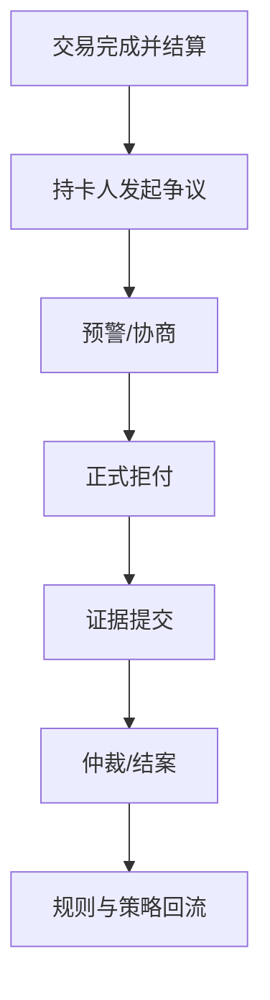

# 07 争议与拒付

> 版本：v0.2  
> 更新时间：2026-04-21  
> 作者：payment-docs  
> 审核：TBD

## 3分钟速读（入门优先）

- 争议是总称，拒付是进入卡组织正式流程后的资金逆向动作。
- 争议治理要前置在预警和客服协商阶段，不能只靠后置抗辩。
- 拒付处理本质是时效管理和证据质量管理。

## 一、本章要解决的问题

- 问题 1：争议（Dispute）与拒付（Chargeback）有什么关系？
- 问题 2：为什么拒付通常滞后发生，但杀伤力更大？
- 问题 3：如何将争议治理从“工单处理”升级为“系统能力”？

## 二、先修知识

- 建议先阅读：[03-交易生命周期.md](03-交易生命周期.md)
- 建议先阅读：[06-风控.md](06-风控.md)

## 三、一图总览

图说明：

- 输入：已发生交易与后续投诉/争议事件。
- 处理：预警、举证、仲裁、资金逆向处理。
- 输出：争议结果、损失确认、策略优化输入。

## 四、核心概念定义

### 4.1 争议与拒付的关系

- 争议是总称，拒付是争议机制中的一种正式资金逆向流程。
- 争议可在预警层解决，不一定进入正式拒付。
- 常见误解：把所有售后问题都归类为卡拒付。

### 4.2 争议类型

- 欺诈型争议：交易真实性争议。
- 履约型争议：未收到货、与描述不符等。
- 账单识别型争议：持卡人无法识别账单描述。
- 订阅型争议：取消与续费规则不清导致争议。

## 五、主流程拆解

### 5.1 阶段 1：预警与早处置

- 参与方：风控、客服、商户运营。
- 核心动作：识别预警事件，快速退款或补充服务，降低正式拒付概率。
- 关键输出：预警关闭率与阻断率。

### 5.2 阶段 2：正式拒付处理

- 参与方：争议运营、法务/合规、商户。
- 核心动作：按规则时限收集证据并提交抗辩材料。
- 关键输出：胜诉/败诉结果与资金影响。

### 5.3 阶段 3：策略回流

- 参与方：风控、产品、技术、商户管理。
- 核心动作：按争议原因回流到准入、交易、结算策略。
- 关键输出：争议率下降与损失率改善。

## 六、常见异常与误区

### 6.1 争议处理超时

- 现象：因证据提交超期导致直接败诉。
- 根因：时效管理缺失、材料分散、责任人不清。
- 排查路径：梳理时限规则 -> 建立 SLA -> 自动提醒与升级机制。

### 6.2 证据质量低导致败诉率高

- 现象：提交证据但胜诉率持续偏低。
- 根因：证据链不完整，无法证明交易真实性与履约事实。
- 排查路径：按争议类型标准化证据模板 -> 复盘败诉样本 -> 优化取证流程。

## 七、实战案例

案例背景：

- 地区：美国
- 支付方式：卡支付
- 商户类型：跨境电商
- 关键约束：友好欺诈比例高，物流时效波动

案例过程：

1. 建立预警通道优先退款策略，减少进入正式拒付的案件量。
2. 对高频争议原因建立“证据包模板”并自动拉取数据。
3. 将争议原因映射到商品、履约、账单描述策略中做前置优化。

案例结论：

- 成功点：正式拒付率和败诉率同步下降。
- 失败点：初期过度依赖人工处理，扩容后效率不足。
- 可复用策略：争议治理必须系统化，不可只靠人海战术。

## 新手最容易错的 3 件事

1. 把普通售后问题直接当拒付案件处理，浪费处理资源。
2. 忽略证据提交时限，导致“还没开打就败诉”。
3. 拒付结案后不回流策略，问题在同类商户反复出现。

## 八、Checklist

- [ ] 是否建立争议与拒付的分类口径
- [ ] 是否有预警优先处置机制
- [ ] 是否有标准化证据模板与SLA
- [ ] 是否将争议结果回流到风控与商户管理

## 九、本章总结

- 争议是全链路风险，不是售后末端问题。
- 拒付治理重点在“前置预防+快速处置+证据标准化”。
- 争议能力本质是守住已获得收入的能力。

## 十、下一章预告

下一章进入入门主线收尾，聚焦“支付成功未到账”排障：

- [11-对账与排障手册.md](11-对账与排障手册.md)

补充资料：

- 拒付证据模板库：[12-拒付证据模板库.md](12-拒付证据模板库.md)
- 拒付自动化编排：[16-拒付自动化编排.md](16-拒付自动化编排.md)

## 附：变更记录

- 2026-04-21 v0.2：统一入门结构，新增 3 分钟速读与新手易错点；下一章改为入门排障主线。
- 2026-04-20 v0.1：基于系列内容整理首版。
