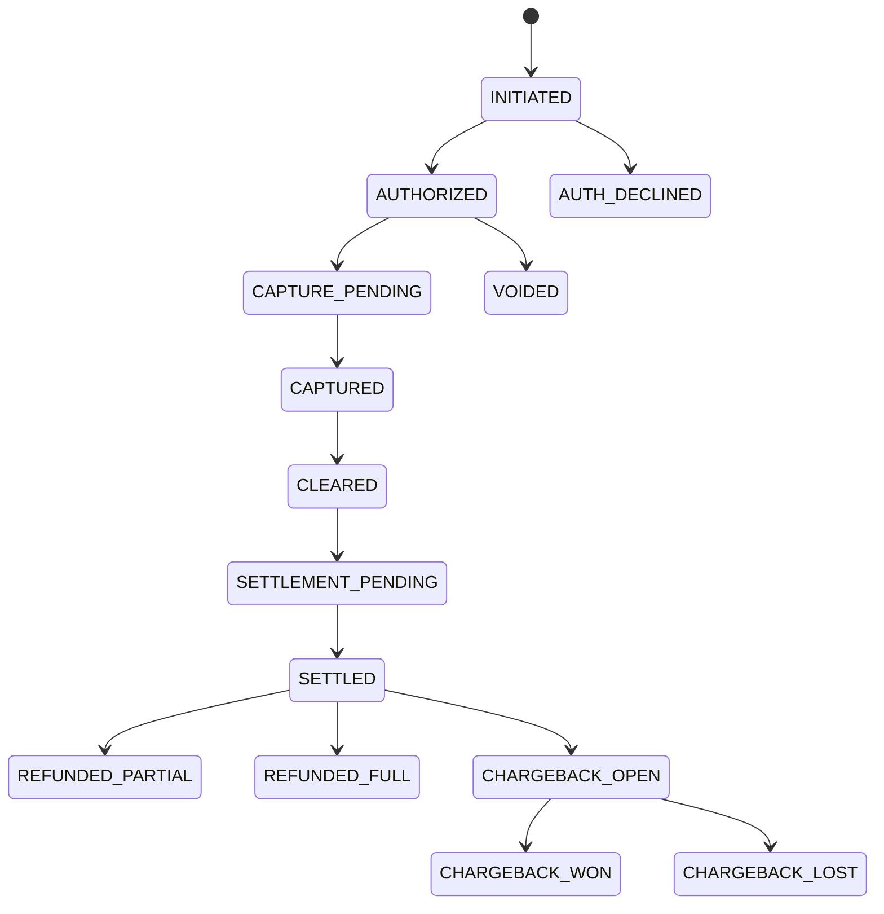

# 09 状态机与事件模型

> 版本：v0.2  
> 更新时间：2026-04-20  
> 作者：payment-docs  
> 审核：TBD

## 一、本章要解决的问题

- 问题 1：支付状态到底应该如何建模，才能同时服务业务、风控、财务？
- 问题 2：哪些状态是“交易状态”，哪些是“账务状态”与“资金状态”？
- 问题 3：如何通过事件模型保证可追溯与可重放？

## 二、先修知识

- 建议先阅读：[03-交易生命周期.md](03-交易生命周期.md)
- 建议先阅读：[04-清算.md](04-清算.md)
- 建议先阅读：[05-结算.md](05-结算.md)

## 三、一图总览

图说明：

- 输入：支付请求及后续逆向事件。
- 处理：交易、账务、资金三层状态按规则推进。
- 输出：可解释、可追溯、可对账的统一状态体系。

## 四、核心概念定义

### 4.1 三层状态模型

- `交易状态（Transaction State）`：交易请求与授权、请款、撤销等业务动作状态。
- `账务状态（Ledger State）`：清算确认后应收应付与费用归集状态。
- `资金状态（Funding State）`：结算出款与银行到账状态。

### 4.2 事件模型（Event Model）

- 定义：以不可变事件驱动状态变化，每次状态变化都必须有事件证据。
- 边界：状态可修正，事件不可篡改；更正以新事件追加。
- 常见误解：直接覆盖状态字段，不保留事件历史。

## 五、推荐状态字典（首版）

| 层级 | 状态 | 说明 | 是否终态 |
|---|---|---|---|
| 交易 | `INITIATED` | 支付请求已创建 | 否 |
| 交易 | `AUTHORIZED` | 授权通过 | 否 |
| 交易 | `AUTH_DECLINED` | 授权拒绝 | 是 |
| 交易 | `CAPTURE_PENDING` | 等待请款 | 否 |
| 交易 | `CAPTURED` | 已请款 | 否 |
| 交易 | `VOIDED` | 已撤销 | 是 |
| 账务 | `CLEARED` | 清算确认完成 | 否 |
| 资金 | `SETTLEMENT_PENDING` | 等待结算/出款 | 否 |
| 资金 | `SETTLED` | 已结算（平台视角） | 否 |
| 资金 | `PAID_OUT` | 已向商户出款 | 否 |
| 资金 | `BANK_POSTED` | 银行到账确认 | 是 |
| 逆向 | `REFUNDED_PARTIAL` | 部分退款 | 否 |
| 逆向 | `REFUNDED_FULL` | 全额退款 | 是 |
| 逆向 | `CHARGEBACK_OPEN` | 拒付处理中 | 否 |
| 逆向 | `CHARGEBACK_WON` | 拒付胜诉 | 是 |
| 逆向 | `CHARGEBACK_LOST` | 拒付败诉 | 是 |

## 六、事件字段最小集合（建议）

- `event_id`: 事件唯一标识
- `payment_id`: 交易主键
- `event_type`: 事件类型（如 `AUTH_APPROVED`）
- `event_time`: 事件发生时间（UTC）
- `source_system`: 事件来源系统
- `idempotency_key`: 幂等键
- `amount` / `currency`: 事件金额与币种
- `raw_payload_ref`: 原始报文引用
- `trace_id`: 链路追踪标识

## 七、常见异常与误区

### 7.1 终态定义冲突

- 现象：不同系统对“成功”定义不同，导致报表冲突。
- 根因：缺少统一状态字典和终态约定。
- 处理建议：统一“业务成功、账务成功、资金成功”三个终态口径。

### 7.2 状态被覆盖无法追责

- 现象：问题出现后无法还原状态变化过程。
- 根因：未保留不可变事件日志。
- 处理建议：事件不可变，任何修正使用追加事件实现。

## 八、Checklist

- [ ] 是否定义三层状态模型
- [ ] 是否建立统一状态字典与终态规则
- [ ] 是否支持事件幂等与去重
- [ ] 是否能按 `payment_id` 回放完整事件序列

## 九、本章总结

- 状态机是支付系统的“公共语言”，不是实现细节。
- 事件模型决定了系统可追溯性和审计能力。
- 先统一状态，再做分析和优化，否则所有指标都不稳。

## 十、下一章预告

下一章将给出收单核心指标口径，保证业务、风控、财务看的是同一组数据。

## 附：变更记录

- 2026-04-20 v0.2：新增状态机与事件模型基线。

