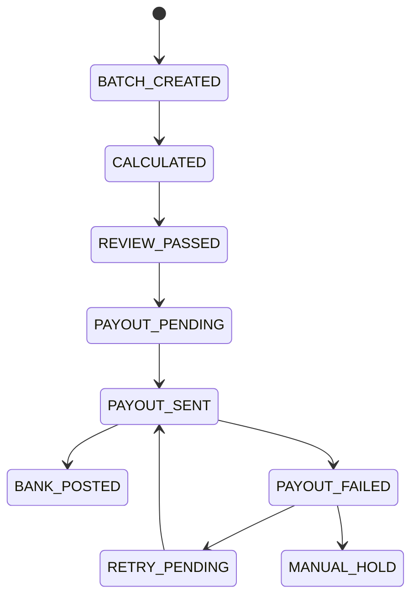

# 14 结算引擎设计稿

> 版本：v0.5  
> 更新时间：2026-04-20  
> 作者：payment-docs  
> 审核：TBD

## 一、本章要解决的问题

- 问题 1：结算引擎的最小可用架构应该如何设计？
- 问题 2：如何把费率、准备金、结算周期做成可配置规则？
- 问题 3：异常出款和差异回补如何标准化处理？

## 二、先修知识

- 建议先阅读：[05-结算.md](05-结算.md)
- 建议先阅读：[09-状态机与事件模型.md](09-状态机与事件模型.md)
- 建议先阅读：[11-对账与排障手册.md](11-对账与排障手册.md)

## 三、模板库入口

- 模板目录总览：[templates/settlement-engine/README.md](templates/settlement-engine/README.md)
- 模板 00（架构蓝图）：[templates/settlement-engine/SE-00-架构蓝图.md](templates/settlement-engine/SE-00-架构蓝图.md)
- 模板 01（结算模板配置）：[templates/settlement-engine/SE-01-结算模板配置.md](templates/settlement-engine/SE-01-结算模板配置.md)
- 模板 02（费率与准备金规则）：[templates/settlement-engine/SE-02-费率与准备金规则.md](templates/settlement-engine/SE-02-费率与准备金规则.md)
- 模板 03（清分映射与账务分录）：[templates/settlement-engine/SE-03-清分映射与账务分录.md](templates/settlement-engine/SE-03-清分映射与账务分录.md)
- 模板 04（出款与重试流程）：[templates/settlement-engine/SE-04-出款与重试流程.md](templates/settlement-engine/SE-04-出款与重试流程.md)
- 模板 05（异常回补与复盘）：[templates/settlement-engine/SE-05-异常回补与复盘.md](templates/settlement-engine/SE-05-异常回补与复盘.md)

## 四、结算引擎目标与边界

### 4.1 核心目标

- 计算正确：每笔应付可解释、可追溯。
- 规则可配：费率、周期、准备金支持配置化迭代。
- 资金可控：出款可重试、可暂停、可回补。
- 对账闭环：交易、账务、资金三层数据一致。

### 4.2 系统边界

- 结算引擎负责：应付计算、批次生成、出款指令、状态追踪。
- 不负责：银行卡授权决策与清算网络交换（由交易/清算系统负责）。
- 与外部系统关系：依赖清算结果输入，输出资金侧与财务侧凭证。

## 五、推荐领域模型（MVP）

| 实体 | 关键字段 | 说明 |
|---|---|---|
| SettlementProfile | merchant_id, cycle, currency, payout_method | 商户结算模板 |
| SettlementRule | fee_rule_id, reserve_rule_id, tax_rule_id | 规则集合引用 |
| SettlementBatch | batch_id, batch_date, status, total_payable | 批次主表 |
| SettlementLine | payment_id, gross, fee, reserve, net | 批次明细 |
| PayoutOrder | payout_id, bank_account, amount, status | 出款单 |
| PayoutAttempt | payout_id, attempt_no, channel_code, result | 出款重试记录 |
| SettlementEvent | event_id, entity_id, event_type, event_time | 结算事件日志 |

## 六、状态机建议（结算侧）

## 七、统一规则（强制）

### 7.1 规则版本化

- 所有费率与准备金规则必须带 `rule_version`。
- 规则变更必须记录生效时间与影响商户范围。
- 结算明细必须保留“命中规则快照”。

### 7.2 幂等与防重

- 出款指令必须使用幂等键：`payout_id + attempt_no`。
- 同一批次禁止重复出款；人工重试必须生成新 attempt。
- 任何回补不得覆盖原始分录，只能追加更正分录。

### 7.3 SLA（建议）

| 阶段 | 目标SLA | Owner |
|---|---|---|
| 批次计算完成 | T+0 02:00 前 | 结算技术 |
| 复核完成 | T+0 04:00 前 | 财务运营 |
| 出款完成 | T+0 10:00 前 | 资金运营 |
| 失败重试完成 | T+0 18:00 前 | 资金运营 |

## 八、异常与回补策略

### 8.1 常见异常分类

- 计算异常：费用错误、汇率错误、准备金规则错误。
- 出款异常：银行拒绝、账户无效、通道超时。
- 对账异常：应付与实付不一致、在途超时。

### 8.2 回补原则

1. 先冻结风险商户或异常批次，防止扩大影响。
2. 先修规则，再回补数据，避免重复错误。
3. 回补必须产出独立批次与审计日志。
4. 回补完成后必须执行专项对账与复盘。

## 九、发布与回滚建议

- 发布方式：按商户分层灰度（低风险 -> 中风险 -> 全量）。
- 回滚方式：按批次回滚，不按明细逐笔回滚。
- 必要前置：监控看板、告警阈值、手工兜底流程。

## 十、提交前检查清单

- [ ] 已定义结算领域模型与状态机
- [ ] 已实现规则版本化与命中快照
- [ ] 已实现出款幂等与重试机制
- [ ] 已定义异常分类与回补流程
- [ ] 已完成发布灰度与回滚预案

## 十一、本章总结

- 结算引擎是规则系统 + 账务系统 + 资金执行系统的组合。
- 正确性优先于速度，可解释性优先于“黑盒自动化”。
- 没有异常回补能力的结算引擎，不具备生产可用性。

## 十二、下一章预告

下一阶段建议进入：`3DS/SCA 专题` 或 `拒付自动化编排`。

## 附：变更记录

- 2026-04-20 v0.5：新增结算引擎设计稿与模板库。

