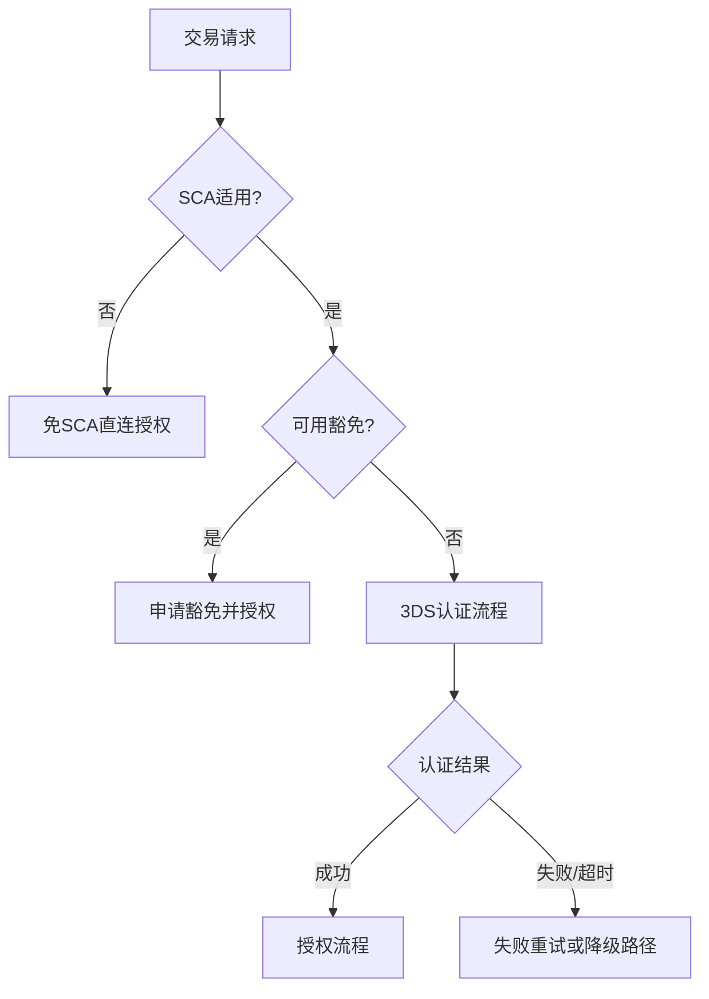

# 15 3DS 与 SCA 专题

> 版本：v0.6  
> 更新时间：2026-04-20  
> 作者：payment-docs  
> 审核：TBD

## 一、本章要解决的问题

- 问题 1：3DS（3-D Secure）与 SCA（Strong Customer Authentication）在实务中如何分工？
- 问题 2：什么场景应强制挑战，什么场景可走豁免？
- 问题 3：如何把认证策略与路由、风控、拒付治理联动？

## 二、先修知识

- 建议先阅读：[03-交易生命周期.md](03-交易生命周期.md)
- 建议先阅读：[06-风控.md](06-风控.md)
- 建议先阅读：[13-通道路由策略模板.md](13-通道路由策略模板.md)

## 三、模板库入口

- 模板目录总览：[templates/3ds-sca/README.md](templates/3ds-sca/README.md)
- 模板 00（策略主卡片）：[templates/3ds-sca/DS-00-策略主卡片.md](templates/3ds-sca/DS-00-策略主卡片.md)
- 模板 01（适用范围矩阵）：[templates/3ds-sca/DS-01-适用范围矩阵.md](templates/3ds-sca/DS-01-适用范围矩阵.md)
- 模板 02（豁免策略模板）：[templates/3ds-sca/DS-02-豁免策略模板.md](templates/3ds-sca/DS-02-豁免策略模板.md)
- 模板 03（认证流程与失败处理）：[templates/3ds-sca/DS-03-认证流程与失败处理.md](templates/3ds-sca/DS-03-认证流程与失败处理.md)
- 模板 04（指标与告警）：[templates/3ds-sca/DS-04-指标与告警.md](templates/3ds-sca/DS-04-指标与告警.md)
- 模板 05（周度复盘）：[templates/3ds-sca/DS-05-周度复盘模板.md](templates/3ds-sca/DS-05-周度复盘模板.md)

## 四、3DS 与 SCA 核心边界

### 4.1 核心定义

- `3DS`：卡支付认证协议与交互框架，用于提升交易认证强度与责任转移能力。
- `SCA`：强客户认证监管要求，强调多因子认证及风险可控的豁免机制。

### 4.2 常见误解

- 误解 1：只要接入 3DS 就自动满足所有 SCA 合规要求。
- 误解 2：所有交易都做挑战认证，成功率一定更高。
- 误解 3：认证策略只影响通过率，不影响拒付与成本。

## 五、策略设计原则（强制）

1. 先合规后优化：先满足地区监管底线，再做转化率优化。
2. 分层策略：按国家、币种、商户风险、交易类型分层。
3. 动态认证：挑战、豁免、降级必须可配置并可回滚。
4. 可解释性：每笔认证决策应可追溯到规则版本与命中条件。

## 六、推荐决策框架（MVP）

## 七、关键联动点

- 与路由联动：不同通道对 3DS 数据质量与挑战成功率差异明显，应进入路由打分。
- 与风控联动：高风险交易应提高挑战比例，低风险交易优先豁免策略。
- 与拒付联动：认证结果必须沉淀到拒付证据包，形成责任链条。

## 八、提交前检查清单

- [ ] 已完成国家/币种 SCA 适用范围映射
- [ ] 已定义挑战与豁免策略阈值
- [ ] 已定义 3DS 失败降级与重试路径
- [ ] 已接入认证核心指标与告警
- [ ] 已建立周度复盘机制

## 九、本章总结

- 3DS 是手段，SCA 是约束，业务目标是“合规前提下的最优转化”。
- 认证策略必须和路由、风控、拒付形成联合优化。
- 没有版本化和回滚能力的认证策略不应上线。

## 十、下一章预告

下一阶段建议进入：`拒付自动化编排`，将预警、取证、提交、复盘串成流水线。

## 附：变更记录

- 2026-04-20 v0.6：新增 3DS/SCA 专题与模板库。

