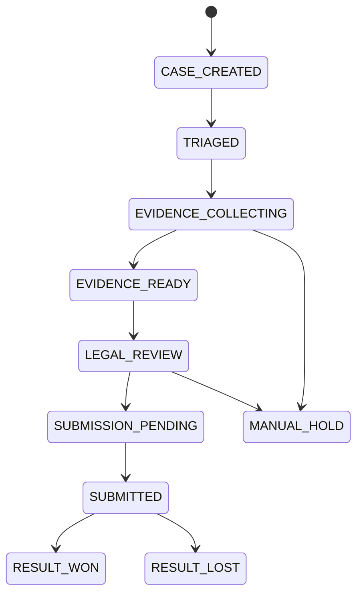

# 16 拒付自动化编排

> 版本：v0.7  
> 更新时间：2026-04-20  
> 作者：payment-docs  
> 审核：TBD

## 一、本章要解决的问题

- 问题 1：如何把拒付处理从“人工工单”升级成“自动化流水线”？
- 问题 2：如何实现预警分流、自动取证、自动提交与SLA闭环？
- 问题 3：如何让拒付处理质量可量化、可追责、可持续优化？

## 二、先修知识

- 建议先阅读：[07-争议与拒付.md](07-争议与拒付.md)
- 建议先阅读：[12-拒付证据模板库.md](12-拒付证据模板库.md)
- 建议先阅读：[11-对账与排障手册.md](11-对账与排障手册.md)

## 三、模板库入口

- 模板目录总览：[templates/chargeback-automation/README.md](templates/chargeback-automation/README.md)
- 模板 00（编排主卡片）：[templates/chargeback-automation/CA-00-编排主卡片.md](templates/chargeback-automation/CA-00-编排主卡片.md)
- 模板 01（预警分流规则）：[templates/chargeback-automation/CA-01-预警分流规则.md](templates/chargeback-automation/CA-01-预警分流规则.md)
- 模板 02（取证流水线）：[templates/chargeback-automation/CA-02-取证流水线.md](templates/chargeback-automation/CA-02-取证流水线.md)
- 模板 03（提交流水线与SLA）：[templates/chargeback-automation/CA-03-提交流水线与SLA.md](templates/chargeback-automation/CA-03-提交流水线与SLA.md)
- 模板 04（质量评分与抽检）：[templates/chargeback-automation/CA-04-质量评分与抽检.md](templates/chargeback-automation/CA-04-质量评分与抽检.md)
- 模板 05（周度复盘）：[templates/chargeback-automation/CA-05-周度复盘模板.md](templates/chargeback-automation/CA-05-周度复盘模板.md)

## 四、自动化编排目标与边界

### 4.1 核心目标

- 缩短时效：拒付入库到提交全流程自动推进。
- 提升质量：证据包完整率和一致性可量化提升。
- 降低损失：减少超时败诉与低质量败诉。
- 形成闭环：败诉原因自动回流到风控与产品策略。

### 4.2 系统边界

- 编排系统负责：案件状态机、任务派发、证据聚合、提交流程、质量评分。
- 业务系统负责：交易、履约、客服、账务的原始事实数据。
- 人工负责：复杂案例复核、法务判断、特例处理。

## 五、推荐状态机（案件侧）

## 六、标准流水线（MVP）

1. 拒付入库：接收通道拒付事件，生成 `case_id`。
2. 自动分流：按原因码、金额、国家、商户风险分层路由。
3. 自动取证：并行拉取交易、履约、沟通、账单证据。
4. 质量评分：对完整性、一致性、可验证性打分。
5. 自动提交：符合阈值自动提交，不符合进入人工复核。
6. 结果回流：胜诉/败诉原因回流策略系统。

## 七、关键控制点（强制）

- `SLA控制`：每个状态设置超时阈值与升级动作。
- `幂等控制`：同一拒付事件只创建一个有效案件。
- `证据版本化`：提交时固化证据包版本，禁止覆盖。
- `审计可追溯`：关键动作记录操作人、时间、规则版本。

## 八、核心指标（建议）

| 指标 | 定义 | 目标方向 |
|---|---|---|
| 自动分流命中率 | 自动分流案件 / 总案件 | 上升 |
| 自动取证完成率 | 自动取证成功案件 / 总案件 | 上升 |
| 按时提交率 | 截止前完成提交案件 / 总案件 | 上升 |
| 自动提交占比 | 无人工干预直接提交案件 / 总案件 | 上升 |
| 证据质量均分 | 提交前评分平均值 | 上升 |
| 超时败诉率 | 因超时导致败诉案件 / 总案件 | 下降 |

## 九、提交前检查清单

- [ ] 已定义案件状态机和SLA阈值
- [ ] 已配置自动分流规则和人工兜底规则
- [ ] 已完成证据自动拉取映射表
- [ ] 已实现证据质量评分和抽检机制
- [ ] 已建立败诉原因回流机制

## 十、本章总结

- 拒付自动化的核心不是“全部无人化”，而是“可控自动化”。
- 自动化编排必须和证据模板、SLA、质量评分同时上线。
- 只有把结果回流到策略系统，自动化才有长期价值。

## 十一、下一章预告

下一阶段建议进入：`跨区域合规控制台` 或 `支付运营自动化`。

## 附：变更记录

- 2026-04-20 v0.7：新增拒付自动化编排与模板库。

