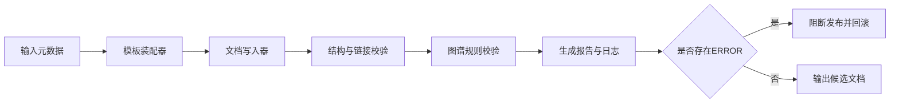

# 24 模板生成器原型实现方案

> 版本：v1.4  
> 更新时间：2026-04-20  
> 作者：payment-docs  
> 审核：TBD

## 一、本章要解决的问题

- 问题 1：如何把“规范稿”落地为可执行的模板生成器原型？
- 问题 2：原型阶段的输入输出边界、执行流程与回滚机制如何定义？
- 问题 3：如何将结构校验、链接校验、图谱校验纳入同一生成流水线？

## 二、先修知识

- 建议先阅读：[22-模板自动生成器规范稿.md](22-模板自动生成器规范稿.md)
- 建议先阅读：[23-图谱自动校验规范.md](23-图谱自动校验规范.md)
- 建议先阅读：[generator-spec/README.md](generator-spec/README.md)

## 三、原型资产入口

- 原型方案索引：[generator-prototype/README.md](generator-prototype/README.md)
- 里程碑计划：[generator-prototype/里程碑计划.md](generator-prototype/里程碑计划.md)
- 输入输出契约：[generator-prototype/输入输出契约.md](generator-prototype/输入输出契约.md)
- 执行架构草图：[generator-prototype/执行架构草图.md](generator-prototype/执行架构草图.md)
- 发布与回滚策略：[generator-prototype/发布与回滚策略.md](generator-prototype/发布与回滚策略.md)

## 四、原型边界与非目标

### 4.1 原型边界（做什么）

1. 支持 `chapter` 类型骨架生成。
2. 支持 `safe_append` 与 `force_replace` 两种覆盖策略。
3. 生成后执行结构校验、链接校验、图谱校验。
4. 生成日志可追溯（输入参数、输出文件、校验结果）。

### 4.2 非目标（暂不做）

1. 不做自然语言自动写作。
2. 不做复杂多语言模板分支。
3. 不做全量历史文档自动重构。
4. 不做在线编辑器和多人实时协作。

## 五、原型执行链路

图说明：

- 输入：文档元数据、模板类型、覆盖策略、输出路径。
- 处理：模板装配、落盘、校验、报告生成、风险判定。
- 输出：候选文档、校验报告、生成日志、发布门禁结果。

## 六、里程碑拆解（建议 4 周）

1. 第 1 周：完成输入契约与 `chapter` 骨架生成。
2. 第 2 周：接入结构校验与链接校验，并产出生成日志。
3. 第 3 周：接入图谱自动校验规则和报告模板。
4. 第 4 周：接入发布门禁、回滚机制和试点发布复盘。

## 七、关键设计约束

| 约束 | 原因 | 约束要求 |
|---|---|---|
| 幂等性 | 避免重复生成污染文档 | 相同输入重复执行结果一致 |
| 可追溯 | 便于审计与问题定位 | 每次执行必须输出日志与版本号 |
| 可回滚 | 降低误覆盖风险 | 支持一键恢复到生成前状态 |
| 可扩展 | 支持后续模板类型拓展 | 输入契约允许新增字段 |

## 八、与校验体系的衔接

1. 结构校验：确保章节最小结构完整。
2. 链接校验：确保所有 markdown 相对链接可达。
3. 图谱校验：引用 [diagram-validator/规则清单.md](diagram-validator/规则清单.md) 进行 `ERROR/WARN/INFO` 分级。
4. 门禁策略：存在 `ERROR` 直接阻断发布；`WARN` 允许带风险发布并记录。

## 九、验收标准（MVP）

- 可在单次命令中生成至少 1 份标准章节骨架。
- 覆盖策略符合规范，不发生未预期覆盖。
- 校验报告可读、可归档、可回溯。
- 发布门禁可正确识别并阻断 `ERROR`。
- 试点章节至少完成一次“生成 -> 校验 -> 发布”闭环。

## 十、提交前检查清单

- [ ] 已完成输入输出契约评审
- [ ] 已完成 `chapter` 骨架生成
- [ ] 已接入结构、链接、图谱三类校验
- [ ] 已提供发布与回滚策略
- [ ] 已沉淀首轮试点复盘

## 十一、本章总结

- 原型阶段的核心不是“功能多”，而是“链路闭环可运行”。
- 生成能力必须和校验能力一起设计，不能后补。
- 只要输入契约稳定，后续模板扩展就具备可复制性。

## 十二、下一章预告

下一章进入规则治理阶段，重点覆盖版本号策略、变更分级、兼容窗口和回滚机制：

- [25-规则版本治理手册.md](25-规则版本治理手册.md)
- [governance-spec/README.md](governance-spec/README.md)

## 附：变更记录

- 2026-04-20 v1.4：补充下一章阅读链路与治理规范入口。
- 2026-04-20 v1.3：新增模板生成器原型实现方案。
