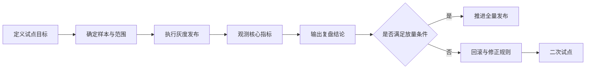

# 26 试点复盘案例

> 版本：v1.6  
> 更新时间：2026-04-20  
> 作者：payment-docs  
> 审核：TBD

## 一、本章要解决的问题

- 问题 1：规则升级后，如何用试点复盘判断“该不该全量”？
- 问题 2：如何把试点过程沉淀为可复用的复盘资产，而不是一次性记录？
- 问题 3：复盘结论如何反哺规则版本治理与发布策略？

## 二、先修知识

- 建议先阅读：[25-规则版本治理手册.md](25-规则版本治理手册.md)
- 建议先阅读：[governance-spec/规则变更流程.md](governance-spec/规则变更流程.md)
- 建议先阅读：[governance-spec/兼容性矩阵模板.md](governance-spec/兼容性矩阵模板.md)

## 三、复盘资产入口

- 试点案例索引：[pilot-casebook/README.md](pilot-casebook/README.md)
- 试点复盘模板：[pilot-casebook/PILOT-TEMPLATE.md](pilot-casebook/PILOT-TEMPLATE.md)
- 案例 01（规则升级灰度复盘）：[pilot-casebook/PILOT-01-规则升级灰度复盘.md](pilot-casebook/PILOT-01-规则升级灰度复盘.md)

## 四、试点设计原则（强制）

1. 小范围：优先选低风险国家、商户或通道进行首轮灰度。
2. 可观测：必须定义基线值、告警阈值和观测窗口。
3. 可回滚：发布前先验证回滚路径和预计恢复时间。
4. 可归因：关键指标需可追踪到规则版本和发布时间点。

## 五、标准试点闭环

图说明：

- 输入：规则版本、试点范围、基线指标和放量门槛。
- 处理：灰度执行、数据观测、异常分析、结论评估。
- 输出：全量发布决策、回滚动作、改进项和复盘文档。

## 六、复盘结论分级（建议）

| 结论等级 | 适用情况 | 后续动作 |
|---|---|---|
| `GO` | 指标稳定、无高优先级事故 | 进入全量发布 |
| `HOLD` | 部分指标波动超阈值 | 延长观测或缩小范围 |
| `ROLLBACK` | 触发回滚条件或出现 P0/P1 事故 | 立即回滚并复盘修正 |

## 七、核心指标对照模板

| 指标 | 试点前基线 | 试点期均值 | 波动幅度 | 结论 |
|---|---|---|---|---|
| 支付成功率 | `{{x%}}` | `{{y%}}` | `{{Δ%}}` | `{{正常/异常}}` |
| 规则误报率 | `{{x%}}` | `{{y%}}` | `{{Δ%}}` | `{{正常/异常}}` |
| 拒付率 | `{{x%}}` | `{{y%}}` | `{{Δ%}}` | `{{正常/异常}}` |
| MTTR | `{{x分钟}}` | `{{y分钟}}` | `{{Δ}}` | `{{正常/异常}}` |

## 八、常见失败模式

1. 范围过大：首轮灰度覆盖过广，导致风险暴露不可控。
2. 口径不一致：基线和试点指标统计口径不一致，结论失真。
3. 回滚不完整：只回滚规则配置，未回滚关联阈值或白名单。
4. 复盘缺行动：只写结论不写 owner 与截止日期，改进难落地。

## 九、提交前检查清单

- [ ] 已定义试点范围、基线和阈值
- [ ] 已记录完整的灰度时间线
- [ ] 已输出指标对照和异常解释
- [ ] 已明确 `GO/HOLD/ROLLBACK` 结论
- [ ] 已回填治理资产与后续行动项

## 十、本章总结

- 试点复盘是规则治理从“设计正确”走向“运行正确”的关键环节。
- 不可观测的试点等于无效试点，不可回滚的试点等于高风险发布。
- 标准化复盘模板可以持续降低升级决策成本。

## 十一、下一章预告

下一章将沉淀“自动发布脚本说明”，把试点决策和发布门禁连接成可执行流水线：

- [27-自动发布脚本说明.md](27-自动发布脚本说明.md)
- [release-automation/README.md](release-automation/README.md)

## 附：变更记录

- 2026-04-20 v1.6：补充自动发布章节与发布自动化入口。
- 2026-04-20 v1.5：新增试点复盘案例章节与案例入口。
