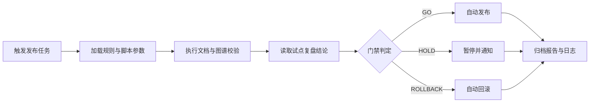

# 27 自动发布脚本说明

> 版本：v1.7  
> 更新时间：2026-04-20  
> 作者：payment-docs  
> 审核：TBD

## 一、本章要解决的问题

- 问题 1：如何把“规则校验 + 试点结论”接入自动发布脚本，实现标准化放量？
- 问题 2：发布门禁脚本需要哪些核心参数，才能兼顾安全与效率？
- 问题 3：脚本失败时如何自动回滚并保留可追溯的审计信息？

## 二、先修知识

- 建议先阅读：[25-规则版本治理手册.md](25-规则版本治理手册.md)
- 建议先阅读：[26-试点复盘案例.md](26-试点复盘案例.md)
- 建议先阅读：[generator-prototype/发布与回滚策略.md](generator-prototype/发布与回滚策略.md)

## 三、自动化资产入口

- 发布自动化索引：[release-automation/README.md](release-automation/README.md)
- 门禁脚本参数手册：[release-automation/门禁脚本参数手册.md](release-automation/门禁脚本参数手册.md)
- 自动发布脚本模板：[release-automation/自动发布脚本模板.md](release-automation/自动发布脚本模板.md)

## 四、脚本目标与边界

### 4.1 目标（必须）

1. 自动执行结构、链接、图谱、规则版本一致性校验。
2. 依据试点复盘结论自动决定 `GO/HOLD/ROLLBACK`。
3. 输出结构化报告并同步发布日志。
4. 在失败场景触发一键回滚与告警通知。

### 4.2 非目标（暂不做）

1. 不自动生成正文业务内容。
2. 不自动审批高风险 `L3-MAJOR` 规则变更。
3. 不替代人工复盘结论确认。

## 五、标准发布链路

图说明：

- 输入：发布版本、规则版本、门禁参数、试点结论。
- 处理：校验执行、门禁判定、发布或回滚、通知与归档。
- 输出：发布状态、校验报告、审计日志、告警记录。

## 六、脚本结构建议

| 模块 | 作用 | 输入 | 输出 |
|---|---|---|---|
| `config-loader` | 解析参数与默认值 | CLI 参数、环境变量 | 标准化配置 |
| `validator-runner` | 执行各类校验 | 配置、规则集、文档路径 | 校验结果 |
| `gate-decision` | 产出 GO/HOLD/ROLLBACK | 校验结果、试点结论 | 发布决策 |
| `release-executor` | 执行发布或暂停 | 发布决策、目标版本 | 发布状态 |
| `rollback-executor` | 执行自动回滚 | 回滚策略、备份信息 | 回滚结果 |
| `reporter` | 生成报告与通知 | 全量执行上下文 | 报告文件、通知事件 |

## 七、门禁策略与参数约束

1. `ERROR` 默认阻断；`WARN` 可按阈值控制。
2. `L3-MAJOR` 变更必须启用 `strict` 模式。
3. 任何 `ROLLBACK` 决策必须落库并通知值班。
4. 参数定义以 [release-automation/门禁脚本参数手册.md](release-automation/门禁脚本参数手册.md) 为准。

## 八、失败与回滚策略

| 失败场景 | 触发条件 | 自动动作 |
|---|---|---|
| 校验失败 | 存在 `ERROR` | 停止发布并输出阻断报告 |
| 指标劣化 | 超过阈值 | 转为 `HOLD`，等待人工确认 |
| 严重异常 | 告警达到回滚条件 | 自动执行回滚并通知 |
| 通知失败 | 通知渠道异常 | 记录补偿任务并重试 |

## 九、可观测性指标（建议）

| 指标 | 定义 | 目标方向 |
|---|---|---|
| 自动发布成功率 | 成功发布次数 / 总触发次数 | 上升 |
| 自动回滚成功率 | 回滚成功次数 / 回滚触发次数 | 上升 |
| 门禁误阻断率 | 误阻断任务数 / 阻断任务数 | 下降 |
| 发布总耗时 | 触发到完成的总时间 | 下降 |

## 十、提交前检查清单

- [ ] 已定义脚本参数与默认值
- [ ] 已接入规则版本与试点结论读取
- [ ] 已实现 GO/HOLD/ROLLBACK 判定
- [ ] 已实现自动回滚与通知链路
- [ ] 已完成发布日志与报告归档

## 十一、本章总结

- 自动发布脚本是把治理规则转化为执行能力的关键层。
- 参数清晰、门禁可解释、回滚可执行，才算真正可上线。
- 没有可观测性与归档能力，自动化只会放大不确定性。

## 十二、下一章预告

下一章将沉淀“发布流水线运维 Runbook”，覆盖值班处置、人工接管与故障恢复：

- [28-发布流水线运维Runbook.md](28-发布流水线运维Runbook.md)
- [release-ops/README.md](release-ops/README.md)

## 附：变更记录

- 2026-04-20 v1.7：补充发布运维Runbook与人工接管预案入口。
- 2026-04-20 v1.6：新增自动发布脚本说明与参数手册入口。
