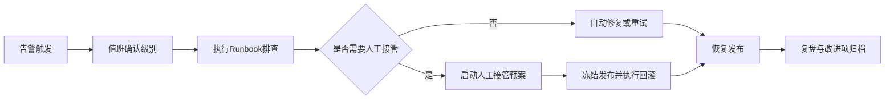

# 28 发布流水线运维 Runbook

> 版本：v1.8  
> 更新时间：2026-04-21  
> 作者：payment-docs  
> 审核：TBD

## 一、本章要解决的问题

- 问题 1：自动发布流水线异常时，值班团队如何快速定位与止损？
- 问题 2：什么情况下应从自动模式切换到人工接管，如何执行不失控？
- 问题 3：发布故障恢复后，如何沉淀可复用的运维经验与改进项？

## 二、先修知识

- 建议先阅读：[27-自动发布脚本说明.md](27-自动发布脚本说明.md)
- 建议先阅读：[release-automation/门禁脚本参数手册.md](release-automation/门禁脚本参数手册.md)
- 建议先阅读：[26-试点复盘案例.md](26-试点复盘案例.md)

## 三、Runbook 资产入口

- 运维 Runbook 索引：[release-ops/README.md](release-ops/README.md)
- 值班处置清单：[release-ops/值班处置清单.md](release-ops/值班处置清单.md)
- 人工接管预案模板：[release-ops/人工接管预案模板.md](release-ops/人工接管预案模板.md)
- 故障恢复演练模板：[release-ops/故障恢复演练模板.md](release-ops/故障恢复演练模板.md)

## 四、运维分级响应模型

| 等级 | 典型场景 | 响应时限 | 处置策略 |
|---|---|---|---|
| `P0` | 发布中断且无法回滚 | 15 分钟 | 立即人工接管 + 冻结发布 |
| `P1` | 门禁误阻断、批量 HOLD | 30 分钟 | 暂停放量 + 快速修复 |
| `P2` | 单次告警抖动、通知失败 | 2 小时 | 观察 + 补偿重试 |

## 五、标准处置链路

图说明：

- 输入：告警事件、发布上下文、门禁与回滚日志。
- 处理：分级判断、排查处置、人工接管、恢复验证、复盘归档。
- 输出：恢复结果、事件结论、后续改进任务。

## 六、人工接管触发条件（强制）

1. 连续 2 次自动回滚失败。
2. 规则门禁结果与试点结论冲突且无法自动判定。
3. 发布任务超时超过阈值（默认 15 分钟）。
4. 通知系统失效导致无法形成值班闭环。

## 七、人工接管最小动作集

1. 冻结当前发布队列并打上事故标签。
2. 锁定版本与规则参数，导出运行快照。
3. 手动执行回滚或灰度缩容策略。
4. 验证核心指标恢复后解除冻结。
5. 生成事故记录并安排 24 小时内复盘。

## 八、恢复验证检查项

- 发布状态：队列恢复、任务无积压。
- 规则状态：规则版本与白名单配置一致。
- 指标状态：成功率、误报率、MTTR 回到基线区间。
- 通知状态：告警渠道恢复并可确认送达。

## 九、提交前检查清单

- [ ] 已定义告警等级与响应SLA
- [ ] 已配置人工接管触发条件
- [ ] 已具备回滚与冻结发布能力
- [ ] 已准备值班清单与恢复演练模板
- [ ] 已定义复盘归档时限与责任人

## 十、本章总结

- 自动发布并不等于“无人值守”，运维 Runbook 是最后一道安全网。
- 人工接管必须有明确触发条件和标准动作，避免临场混乱。
- 恢复只是阶段终点，复盘和演练才是长期稳定性的起点。

## 十一、下一章预告

下一章将沉淀“发布审计与合规留痕专题”，统一审计证据、审批轨迹和监管报表口径：

- [29-发布审计与合规留痕专题.md](29-发布审计与合规留痕专题.md)
- [audit-spec/README.md](audit-spec/README.md)

## 附：变更记录

- 2026-04-21 v1.8：补充发布审计专题与审计规范入口。
- 2026-04-20 v1.7：新增发布流水线运维 Runbook 与人工接管预案入口。
