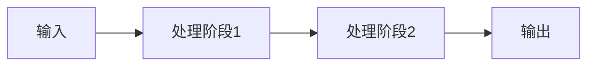
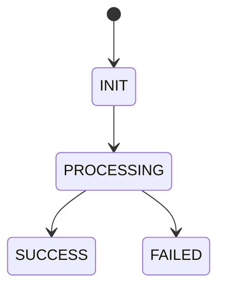
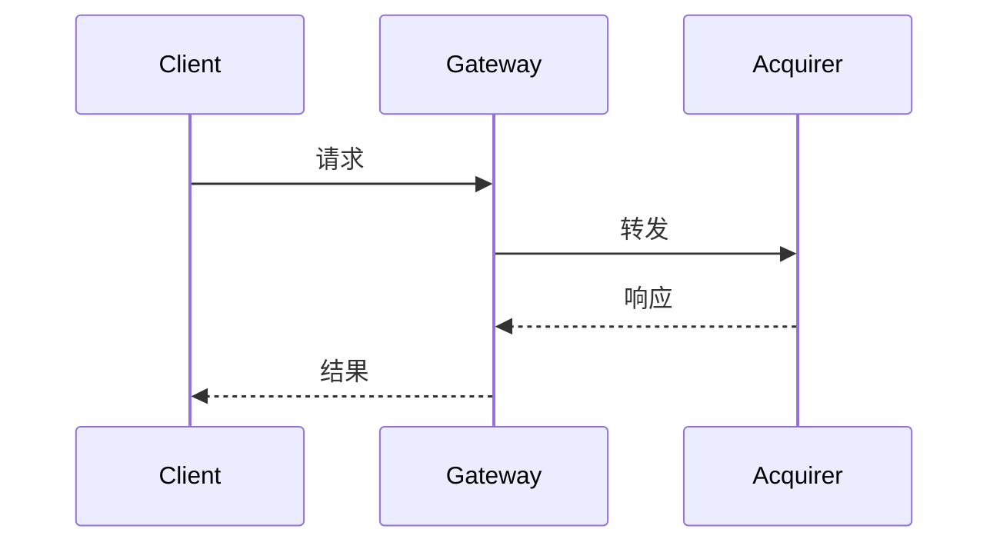

# 通用图谱模板

## 1. 流程图模板

```mermaid
flowchart LR
  A[输入] --> B[处理阶段1]
  B --> C[处理阶段2]
  C --> D[输出]
```

图说明：

- 输入：{输入说明}
- 处理：{处理说明}
- 输出：{输出说明}

## 2. 状态图模板

```mermaid
stateDiagram-v2
  [*] --> INIT
  INIT --> PROCESSING
  PROCESSING --> SUCCESS
  PROCESSING --> FAILED
```

图说明：

- 输入：{触发事件}
- 处理：{状态迁移逻辑}
- 输出：{终态与后续动作}

## 3. 时序图模板

```mermaid
sequenceDiagram
  participant A as Client
  participant B as Gateway
  participant C as Acquirer
  A->>B: 请求
  B->>C: 转发
  C-->>B: 响应
  B-->>A: 结果
```

图说明：

- 输入：{调用发起条件}
- 处理：{关键交互步骤}
- 输出：{结果与状态}

