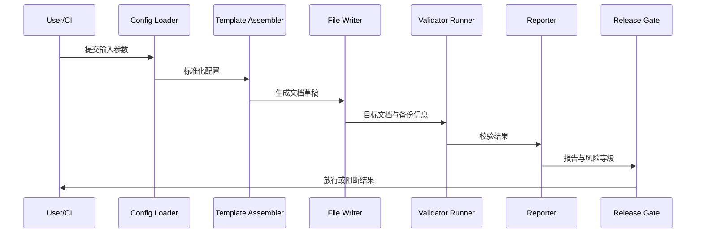

# 模板生成器执行架构草图

> 版本：v1.3  
> 更新时间：2026-04-20

## 1. 架构目标

- 把文档生成流程拆分为独立阶段，便于扩展和排障。
- 每个阶段都有清晰输入与输出，支持可观测和审计。
- 与图谱校验和发布门禁无缝衔接。

## 2. 模块划分

| 模块 | 职责 | 输入 | 输出 |
|---|---|---|---|
| Config Loader | 解析输入参数与默认值 | 配置文件、CLI 参数 | 标准化配置 |
| Template Assembler | 组装章节骨架 | 标准化配置、模板文件 | 文档草稿 |
| File Writer | 写入目标文件与备份 | 文档草稿、路径策略 | 文档文件、备份文件 |
| Validator Runner | 执行结构/链接/图谱校验 | 文档文件、规则集 | 校验结果 |
| Reporter | 生成报告和日志 | 校验结果、执行上下文 | 报告文件、日志文件 |
| Release Gate | 决定是否放行发布 | 校验结果、门禁策略 | 放行/阻断结果 |

## 3. 执行时序（建议）

图说明：

- 输入：配置参数、模板定义、规则集版本。
- 处理：装配、写入、校验、报告、门禁判定。
- 输出：文档文件、日志报告、发布决策。

## 4. 可观测性建议

1. 每个阶段输出统一 `trace_id`。
2. 记录执行耗时（总耗时 + 分阶段耗时）。
3. 记录关键计数（生成块数、校验告警数、回滚次数）。
4. 失败时保留上下文快照用于排障。

## 5. 异常处理建议

| 异常类型 | 触发点 | 处理方式 |
|---|---|---|
| 输入不合法 | Config Loader | 立即失败并返回字段错误 |
| 模板缺失 | Template Assembler | 立即失败并提示模板路径 |
| 文件冲突 | File Writer | 按覆盖策略处理并记录冲突 |
| 校验失败 | Validator Runner | 输出问题清单并阻断门禁 |
| 报告失败 | Reporter | 生成降级文本报告并告警 |

## 附：变更记录

- 2026-04-20 v1.3：新增执行架构草图与模块边界定义。
